# Exercise 01: Getting Started with Microsoft Foundry & AI Agents 

## Scenario

## Overview

## Objectives

In this exercise, you will complete the following tasks:

- Task 1: Environment & Microsoft Foundry Setup 
- Task 2: Agent Basics & Code Interpreter
- Task 3: File Search & Bing Grounding
- Task 4: Enterprise Search, MCP Tools & Foundry IQ

## Task 1: Environment & Microsoft Foundry Setup

1. Open **Visual Studio Code** on your Lab-VM.

   

1. Once the IDE opens, if you see the ***Welcome to VS Code*** sign-in pop-up for GitHub, simply close the window by clicking the **X** in the upper-right corner.

   

1. From the **File** menu in VS Code, choose **Open Folder**.

   

1. Navigate to `C:\Users\azureuser`, select the **agentic-ai-immersion** folder and click **Select folder**.

   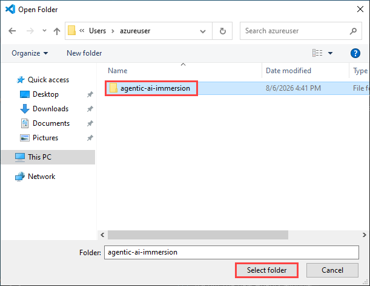

1. Open the integrated terminal by selecting **Terminal → New Terminal**.

   

1. Now you will see another screen *Do you trust the authors of the files in this folder?*, click **Trust Folder & Continue**.

   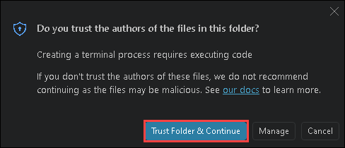

1. In the integrated terminal, verify that Python is installed by running the following command:

   ```bash
   python --version
   ```

   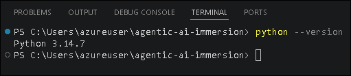

1. Create and activate a Python virtual environment:

   ```
   python -m venv .venv
   ```
   ```
   .\.venv\Scripts\activate
   ```

   > **Note:** After activating the virtual environment, you should see **`(.venv)`** prefixed to the prompt in the VS Code integrated terminal, indicating that the virtual environment is active.

   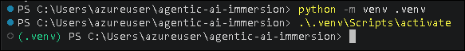

1. Install all required Python packages. The package versions are pinned to ensure a consistent environment and avoid compatibility issues.

   ```
   pip install -r requirements.txt
   ```

   > **Note:** Installing the dependencies may take a few minutes to complete. Wait until the installation finishes successfully before proceeding to the next step.

   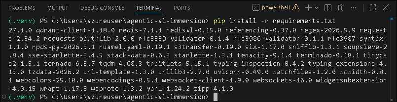

1. Sign in to Azure from the integrated terminal:

   ```
   az login
   ```

   > **Note:** You only need to sign in to Azure once in this lab. Keep using the same integrated terminal session for the upcoming labs so that your Azure authentication remains active.

1. On the *Let’s get you signed in pop-up*, select **Work or school account**, then click **Continue**. You may need to minimize any open applications to bring this window into view.

   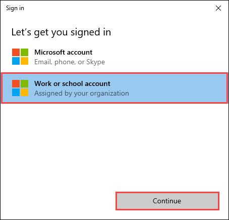

1. You'll see the Sign into Microsoft Azure tab. Here, enter your credentials:

   - **Email/Username:** <inject key="AzureAdUserEmail"></inject>
  
     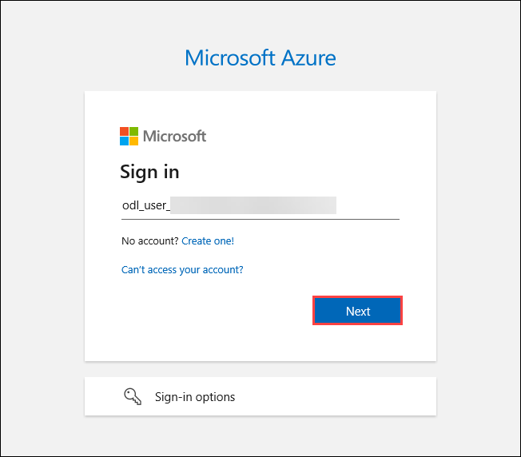
  
1. Next, enter the Temporary Access Pass:

   - **Temporary Access Pass:** <inject key="AzureAdUserPassword"></inject>
  
     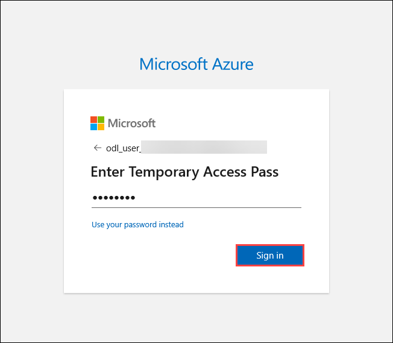

1. On the *Sign in to all apps, websites, and services on this device?*, click **No, this app only**.

   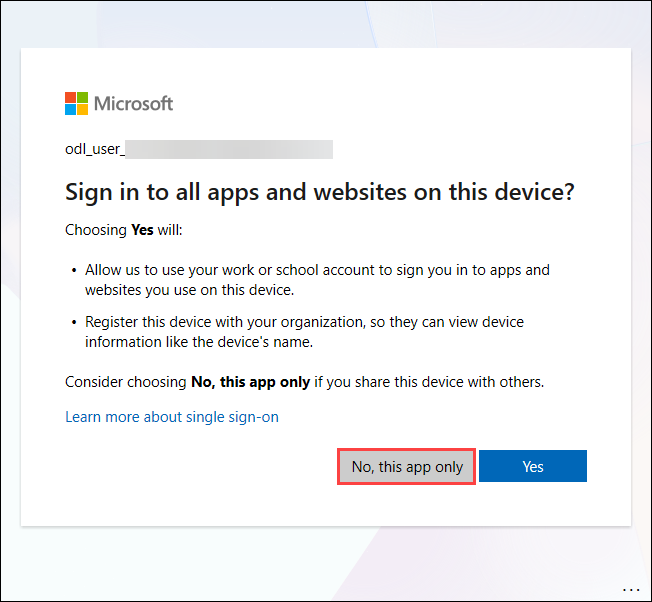

1. You are now signed in to the Azure portal from your Visual Studio Code terminal. In Visual Studio Code integrated terminal, when prompted to select a subscription and tenant, press **Enter** to accept the default selection.

   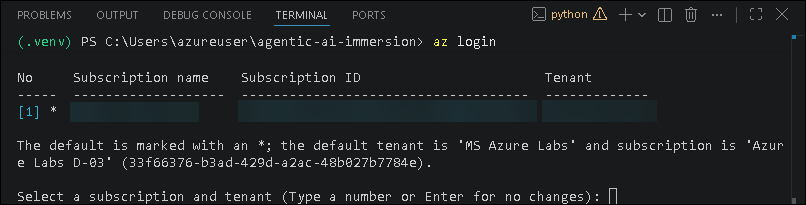

1. Copy the sample environment configuration file to create a new `.env` file in the repository root.

   ```
   cp .env.example .env
   ```

   > **Note:** The `.env` file contains the environment variables required to run the notebooks. You will update this file with your Azure resource details in the next step.

   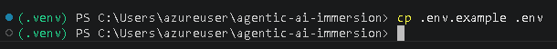

1. Open the `.env` file and update the following environment variables for **AZURE AUTHENTICATION**:

   ```
   TENANT_ID=<inject key="Azure Tenant ID"></inject>
   AZURE_SUBSCRIPTION_ID=<inject key="Azure Subscription ID"></inject>
   AZURE_RESOURCE_GROUP=labvm-rg-<inject key="DeploymentID"></inject>
   AZURE_PROJECT_NAME=foundry-project-<inject key="DeploymentID"></inject>
   ```

   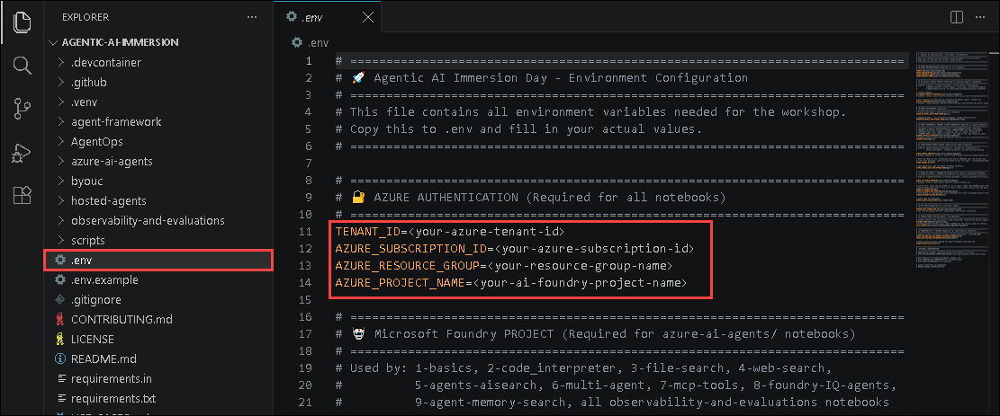

1. In the `.env` file and update the following environment variables for **Microsoft Foundry PROJECT**:

   ```
   AI_FOUNDRY_PROJECT_ENDPOINT=https://foundry-<inject key="DeploymentID"></inject>.services.ai.azure.com/api/projects/foundry-project-<inject key="DeploymentID"></inject>
   PROJECT_RESOURCE_ID=/subscriptions/<inject key="Azure Subscription ID"></inject>/resourceGroups/labvm-rg-<inject key="DeploymentID"></inject>/providers/Microsoft.CognitiveServices/accounts/foundry-<inject key="DeploymentID"></inject>/projects/foundry-project-<inject key="DeploymentID"></inject>
   ```

   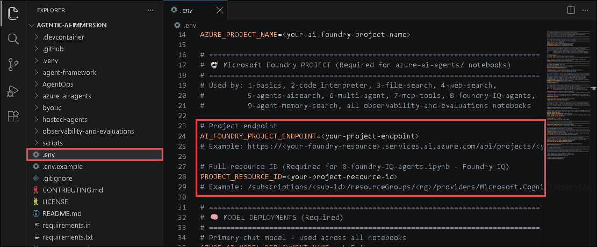

1. In the `.env` file and update the following environment variables for **AGENT FRAMEWORK — FOUNDRY CLIENT CONVENTION**:

   ```
   FOUNDRY_PROJECT_ENDPOINT=https://foundry-<inject key="DeploymentID"></inject>.services.ai.azure.com/api/projects/foundry-project-<inject key="DeploymentID"></inject>
   ```

   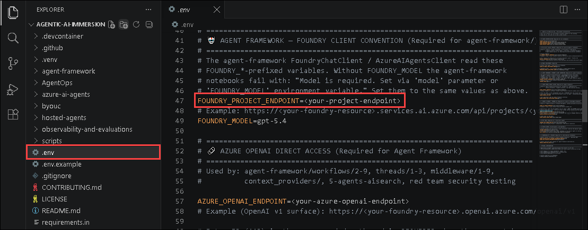

1. Navigate to Azure portal, enter **Microsoft Foundry** in the search bar, and then select **Microsoft Foundry** from the search results.

   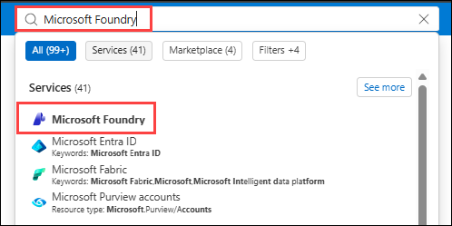

1. In the left navigation pane, under **Use with Foundry**, select **Foundry**, and then choose your **Foundry** resource.

   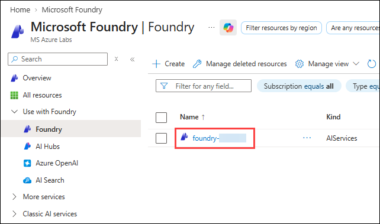

1. On the **Overview** page of your Foundry resource, select **Go to Foundry Portal** to open the Microsoft Foundry portal.

   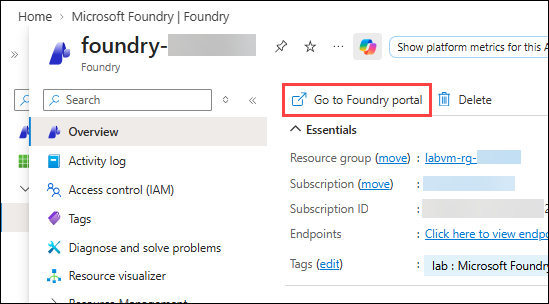

1. In the Microsoft Foundry portal, ensure you are in **Home** tab and copy the **API Key** value.

   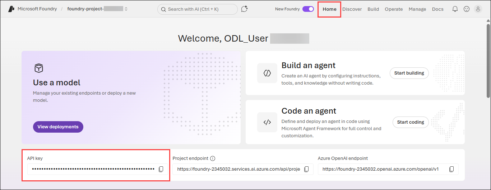

1. In the `.env` file and update the following environment variables for **AZURE OPENAI DIRECT ACCESS**:

   ```
   AZURE_OPENAI_ENDPOINT=https://foundry-<inject key="DeploymentID"></inject>.openai.azure.com/openai/v1
   AZURE_OPENAI_API_KEY=API_KEY_VALUE_COPIED_IN_THE_PREVIOUS_STEP
   ```

   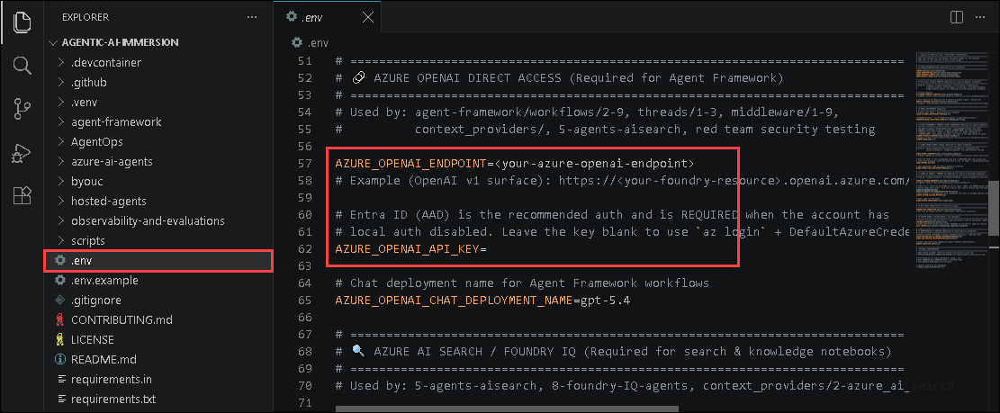

1. Navigate back to Azure portal, enter **AI Search** in the search bar, and then select **AI Search (Foundry IQ)** from the search results.

   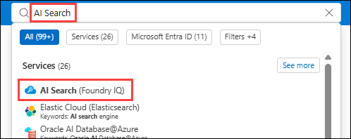

1. In the left navigation pane, under **Use with Foundry**, select **AI Search**, and then choose your **Search service (Foundry IQ)** resource.

   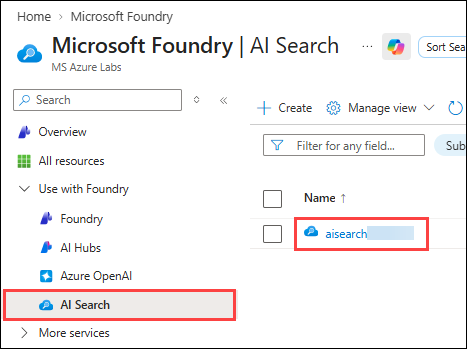

1. In your **Azure AI Search** service resource, navigate to **Security + networking** > **Keys**, and copy the **Primary admin key**.

   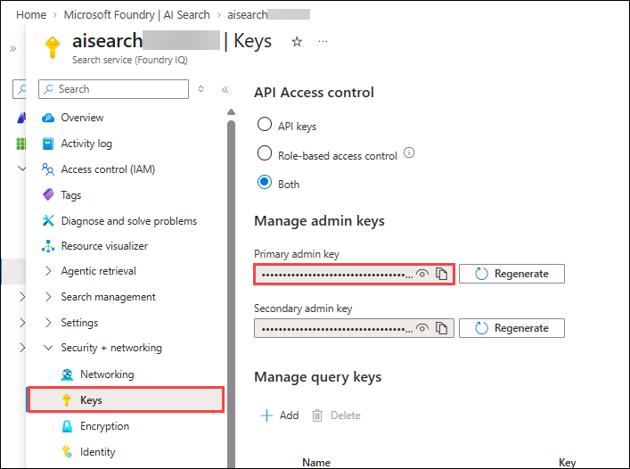

1. In the `.env` file and update the following environment variables for **AZURE AI SEARCH / FOUNDRY IQ**:

   ```
   AZURE_AI_SEARCH_ENDPOINT=https://aisearch<inject key="DeploymentID"></inject>.search.windows.net
   AZURE_AI_SEARCH_API_KEY=PRIMARY-ADMIN__KEY_VALUE_COPIED_IN_THE_PREVIOUS_STEP
   ```

   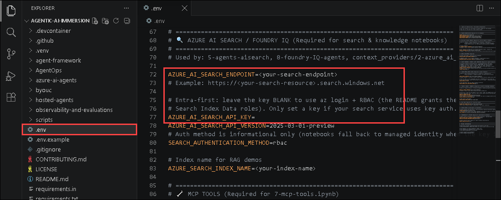

1. After updating all the required environment variables in the **`.env`** file, **Save** the file before proceeding to the next step.

## Task 2: Agent Basics & Code Interpreter

### **`azure-ai-agents/1-basics.ipynb`**

1. Open `azure-ai-agents/1-basics.ipynb`

   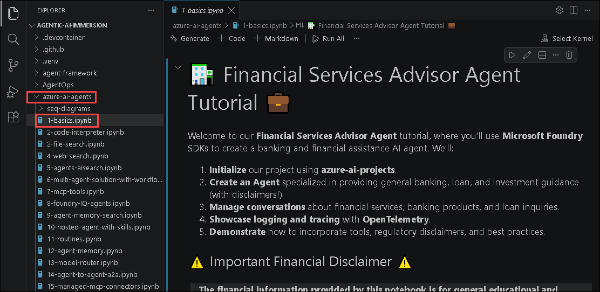

1. This notebook demonstrates how to build a **Financial Services Advisor AI Agent** using the **Microsoft Foundry SDK**. The agent is designed to provide general guidance on banking, loans, and investments while following responsible AI practices, incorporating regulatory disclaimers, and supporting observability through logging and tracing.

   - Initialize and connect to a Microsoft Foundry project using the `azure-ai-projects` SDK.
   - Create and configure a domain-specific Financial Services Advisor agent.
   - Manage conversations using threads, messages, and agent runs.
   - Enable logging and tracing with `OpenTelemetry` for monitoring and diagnostics.
   - Extend the agent with tools and implement financial disclaimers and responsible AI best practices.

1. In the notebook, select **Select Kernel** from the upper-right corner.

   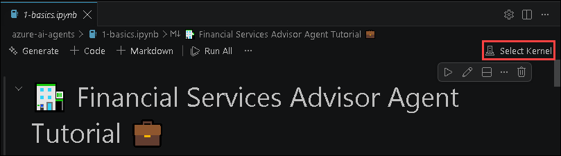

1. On the *Select Kernel* pop-up in the VS Code search bar, select **Install/Enable suggested extensions Python + Jupyter**.

   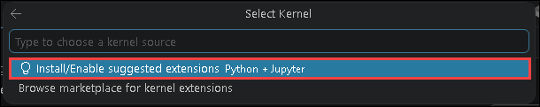

1. On the *Select Another Kernel* pop-up in the VS Code search bar, select **Python Environments...**.

   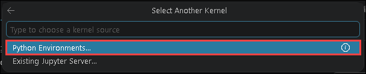

1. On the *Select a Python Environment* pop-up in the VS Code search bar, select **Python 3.14.***.

   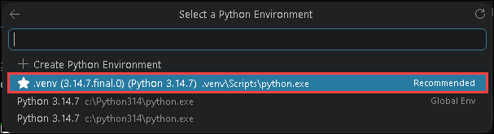

1. Run all the cells individually to setup and build your **Financial Services Advisor Agent**.

1. After running all the cells in the notebook, you would've successfully built a **Financial Services Advisor Agent** that can:

   - Respond to basic banking, loan, and financial questions.
   - Use disclaimers to ensure regulatory compliance and encourage professional consultation.
   - Provide general banking product and savings information.
   - Use the synergy of Microsoft Foundry modules to power the conversation.

### **`azure-ai-agents/2-code-interpreter.ipynb`**

1. Open `azure-ai-agents/2-code-interpreter.ipynb`

   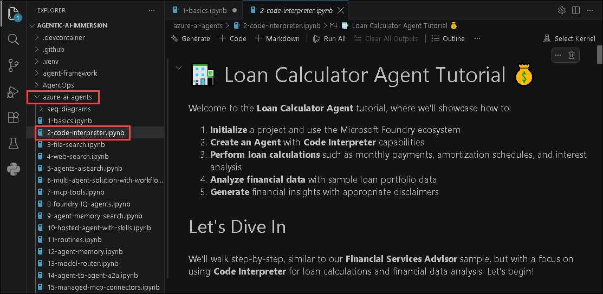

1. This notebook demonstrates how to build a **Loan Calculator AI Agent** using the **Microsoft Foundry SDK**. The agent leverages Code Interpreter capabilities to perform financial calculations, analyze loan-related data, and generate insights for common lending scenarios while following responsible AI practices and providing appropriate financial disclaimers.

   - Initialize and connect to a Microsoft Foundry project using the Microsoft Foundry SDK.
   - Create and configure a Loan Calculator agent with Code Interpreter capabilities.
   - Perform common loan calculations, including monthly payments, amortization schedules, and interest analysis.
   - Analyze sample loan portfolio data to derive financial insights and trends.
   - Generate data-driven responses with appropriate financial disclaimers and responsible AI best practices.

1. In the notebook, select **Select Kernel** from the upper-right corner, and then choose the **Python 3.14.*** kernel.

   

1. Run all the cells individually to setup and build your **Loan Calculator Agent**.

1. After running all the cells in the notebook, you will have successfully built a **Loan Calculator Agent** that can:
   
   - Perform loan calculations, including monthly payments, interest analysis, and amortization schedules.
   - Execute Python code securely using Code Interpreter for financial analysis.
   - Analyze loan portfolio data and generate financial insights.
   - Provide responses with appropriate financial disclaimers and responsible AI practices.
   - Combine Microsoft Foundry and Code Interpreter for intelligent financial assistance.

## Task 3: File Search & Bing Grounding

### **`azure-ai-agents/3-file-search.ipynb`**

1. Open `azure-ai-agents/3-file-search.ipynb`

   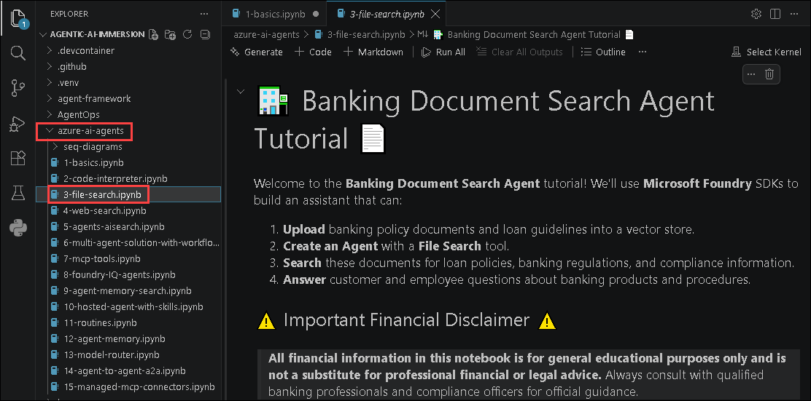

1. This notebook demonstrates how to build a **Banking Document Search AI Agent** using the **Microsoft Foundry SDK**. The agent leverages the **File Search tool** to search banking documents, loan guidelines, and policy manuals, enabling it to answer questions based on uploaded content.

   - Initialize and connect to a Microsoft Foundry project using the Microsoft Foundry SDK.
   - Upload banking policy documents and loan guidelines to a vector store.
   - Create and configure an AI agent with File Search capabilities.
   - Search documents to retrieve relevant banking policies, regulations, and compliance information.
   - Answer customer and employee queries using information from uploaded documents.

1. In the notebook, select **Select Kernel** from the upper-right corner, and then choose the **Python 3.14.*** kernel.

   
  
1. Run all the cells individually to setup and build your **Banking Document Search Agent**.

1. After running all the cells in the notebook, you will have successfully built a **Banking Document Search Agent** that can:

   - Search uploaded banking documents using File Search and semantic search.
   - Retrieve information from banking policies, loan guidelines, and compliance documents.
   - Answer customer and employee queries using document-based knowledge.
   - Provide responses with appropriate financial disclaimers and responsible AI practices.
   - Leverage Microsoft Foundry and File Search for intelligent document retrieval.

### **`azure-ai-agents/4-web-search.ipynb`**

1. Open `azure-ai-agents/4-web-search.ipynb`

   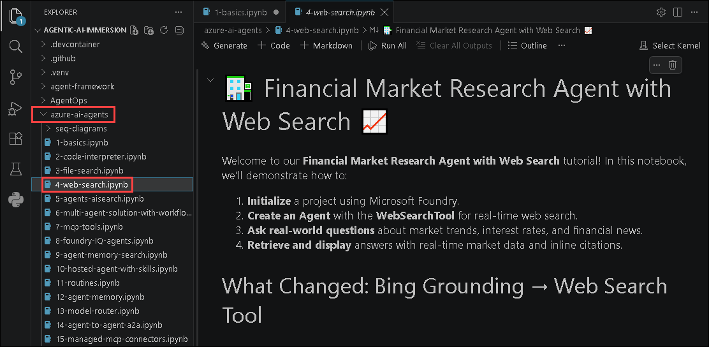

1. This notebook demonstrates how to build a **Financial Market Research AI Agent** using the **Microsoft Foundry SDK**. The agent leverages the **Web Search tool** to retrieve real-time financial information, market trends, interest rates, and news from the web, enabling it to provide up-to-date responses with inline citations.

   - Initialize and connect to a Microsoft Foundry project using the Microsoft Foundry SDK.
   - Create and configure an AI agent with Web Search capabilities.
   - Retrieve real-time financial news, market trends, and interest rate information from the web.
   - Answer financial market research queries using current web-based information.
   - Generate responses with inline citations and responsible AI best practices.

1. In the notebook, select **Select Kernel** from the upper-right corner, and then choose the **Python 3.14.*** kernel.

   
  
1. Run all the cells individually to setup and build your **Financial Market Research Agent** with **Web Search**.

1. After running all the cells in the notebook, you will have successfully built a **Financial Market Research Agent** that can:

   - Retrieve real-time financial news, market trends, and interest rate information using Web Search.
   - Answer market research queries with up-to-date web-based information.
   - Generate responses with inline URL citations for referenced sources.
   - Use location-aware web search to provide more relevant financial insights.
   - Leverage Microsoft Foundry and the Responses API for real-time, citation-backed responses.

## Task 4: Enterprise Search, MCP Tools & Foundry IQ

### **`azure-ai-agents/5-agents-aisearch.ipynb`**

1. Open `azure-ai-agents/5-agents-aisearch.ipynb`

   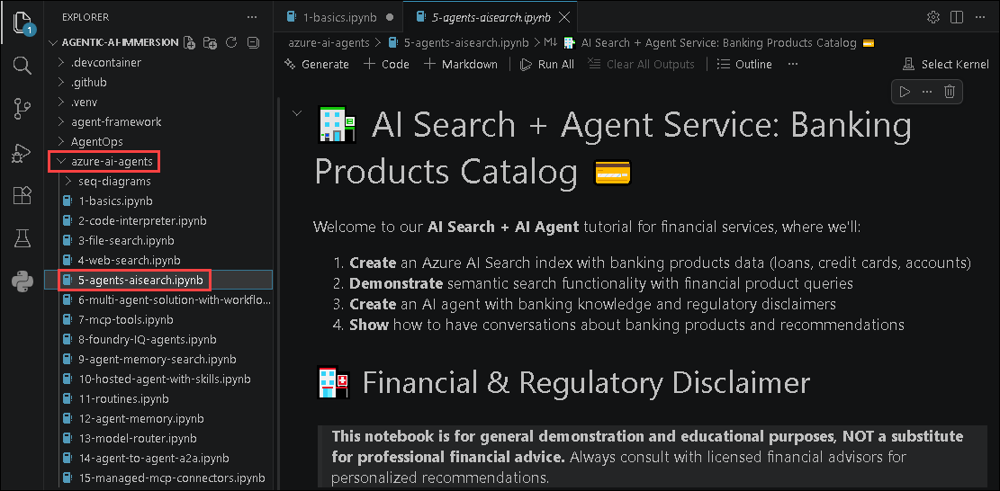

1. This notebook demonstrates how to build a **Banking Products Catalog AI Agent** by integrating **Azure AI Search** with **Microsoft Foundry Agent Service**. The agent uses semantic search to retrieve information from a banking products catalog, enabling it to answer customer queries and provide product recommendations based on indexed financial data.

   - Initialize and connect to a Microsoft Foundry project using the Microsoft Foundry SDK.
   - Create and populate an Azure AI Search index with banking products such as loans, credit cards, and accounts.
   - Perform semantic searches to retrieve relevant banking product information.
   - Create and configure an AI agent integrated with Azure AI Search.
   - Answer banking product queries and recommendations using search-grounded responses while incorporating financial disclaimers and responsible AI best practices.

1. In the notebook, select **Select Kernel** from the upper-right corner, and then choose the **Python 3.14.*** kernel.

   
  
1. In the **Microsoft Foundry** portal, navigate to the **Manage (1)** tab, select **Connected resources (2)**, and then click **Add connection (3)**.

   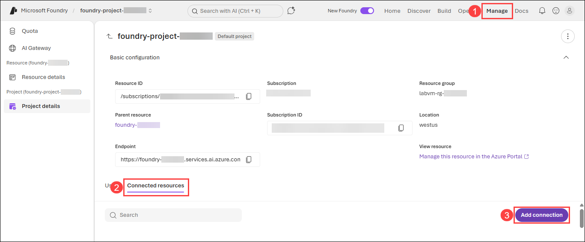

1. On the **Choose a connection** page, select **Azure AI Search (1)**, and then click **Continue (2)**.

   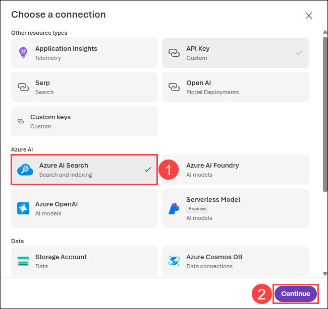

1. On the **Create a new connection** page, select your **Azure AI Search** resource from the dropdown, and then click **Continue**.

   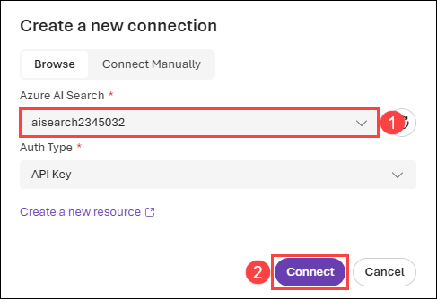

1. Copy the name of the newly created **Azure AI Search** connection. You will use this value in this notebook.

   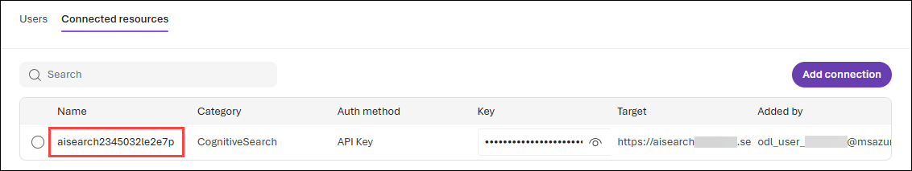

1. In the notebook, under **2. Create Banking Product Advisor Agent With Azure AI Search Tool**, update the value of **`ai_search_connection_name`** with the Azure AI Search connection name you copied in the previous step.

   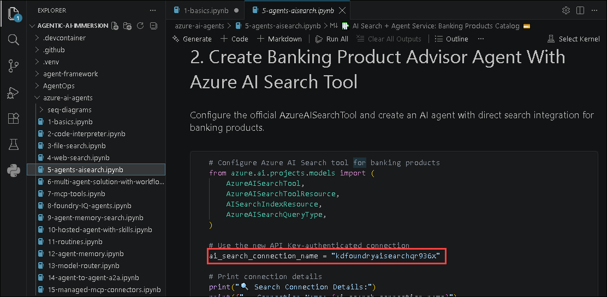

1. Run all the cells individually to setup and build your **Banking Products Catalog AI Agent** by integrating **Azure AI Search** with **Microsoft Foundry Agent Service**.

1. After running all the cells in the notebook, you will have successfully built an **Azure AI Search + Agent Service solution** that can:

   - Perform semantic and vector-based search over a product catalog using Azure AI Search.
   - Retrieve relevant results using vector embeddings and semantic ranking for natural language queries.
   - Create an AI agent that leverages search-grounded responses to answer product-related questions.
   - Understand user intent beyond keyword matching using vector similarity and semantic search.
   - Integrate Azure AI Search, Azure OpenAI embeddings, and Microsoft Foundry Agent Service to deliver intelligent, context-aware responses.

### **`azure-ai-agents/7-mcp-tools.ipynb`**

1. Open `azure-ai-agents/7-mcp-tools.ipynb`

   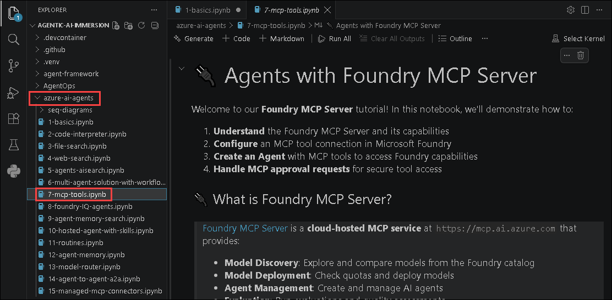

1. This notebook demonstrates how to build an AI Agent that integrates with the **Microsoft Foundry MCP (Model Context Protocol) Server**. The agent uses MCP tools to securely access Microsoft Foundry capabilities, enabling it to interact with external tools and services through a standardized protocol.

   - Understand the Microsoft Foundry MCP Server and its capabilities.
   - Configure an MCP tool connection within a Microsoft Foundry project.
   - Create and configure an AI agent with MCP tool integration.
   - Invoke MCP tools to access Microsoft Foundry capabilities through the agent.
   - Handle MCP approval requests and implement secure tool access using responsible AI best practices.

1. In the notebook, select **Select Kernel** from the upper-right corner, and then choose the **Python 3.14.*** kernel.

   

1. In the **Microsoft Foundry** portal, navigate to the **Build (1)** tab, select **Tools (2)** from navigation pane, and then click **Connect a tool (3)**.

   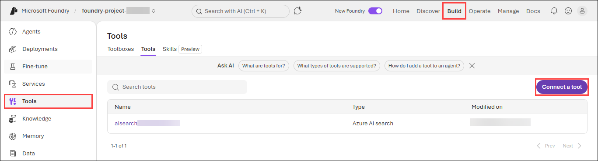

1. On the **Select a tool** page, open the **Catalog (1)** tab, search for **Foundry MCP Server (2)**, select **Foundry MCP Server (Preview) (3)**, and then click **Create (4)**.

   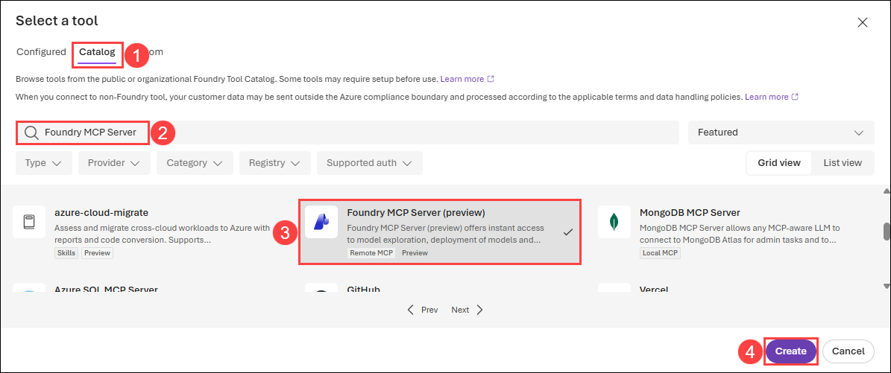

1. On the **Connect the Foundry MCP Server (Preview)** page, leave the default settings unchanged, and then click **Connect**.

   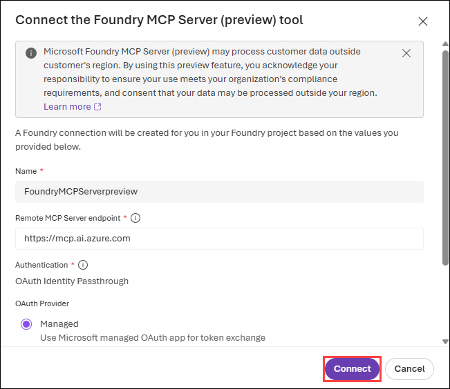

1. After the connection is successfully established, copy the **Project connection ID**. You will use this value when updating the `.env` file in a next step.

   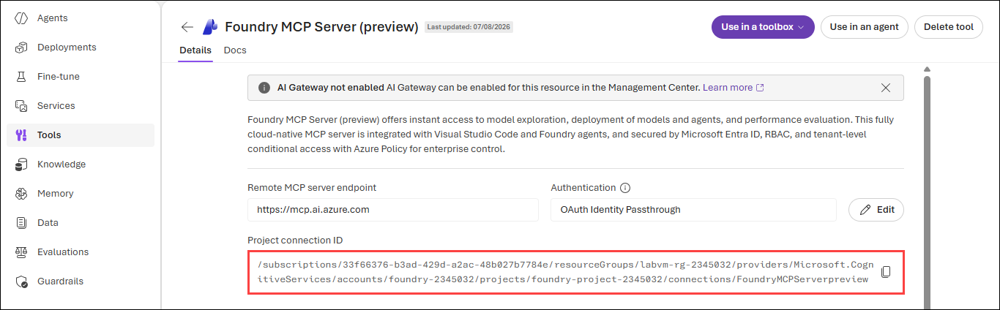
  
1. Navigate back to VS Code, in the `.env` file and update the following environment variables for **MCP TOOLS**:

   ```
   FOUNDRY_MCP_CONNECTION_ID=FOUNDRY_MCP_SERVER_PROJECT_CONNECTION_ID_COPIED_IN_THE_PREVIOUS_STEP
   ```

   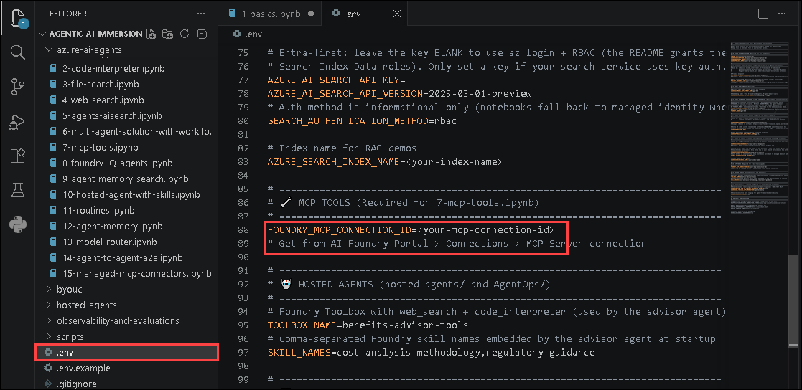

1. Run all the cells individually to setup and build your **Banking Products Catalog AI Agent** by integrating **Azure AI Search** with **Microsoft Foundry Agent Service**.

1. After running all the cells in the notebook, you will have successfully built an AI Agent integrated with the **Microsoft Foundry MCP Server** that can:

   - Connect to Microsoft Foundry using an MCP tool connection.
   - Access Microsoft Foundry capabilities through standardized MCP tools.
   - Securely invoke tools by handling MCP approval requests.
   - Configure MCP connections using project connection IDs.
   - Extend agent capabilities through secure and standardized tool integration.
  
### **`azure-ai-agents/8-foundry-IQ-agents.ipynb`**

1. Open `azure-ai-agents/8-foundry-IQ-agents.ipynb`

   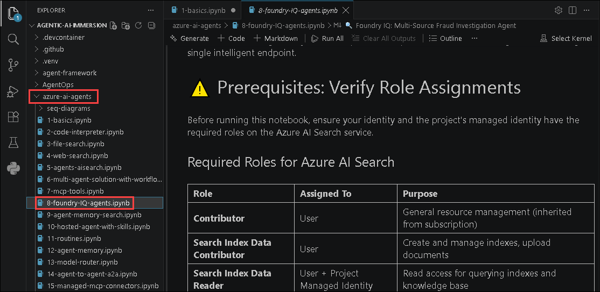

1. In the notebook, select **Select Kernel** from the upper-right corner, and then choose the **Python 3.14.*** kernel.

   

1. This notebook demonstrates how to build a **Fraud Investigation AI Agent** using **Microsoft Foundry IQ**. The agent leverages Foundry IQ as a unified knowledge layer to retrieve information from multiple knowledge sources, enabling intelligent, grounded responses for fraud investigation and compliance scenarios.

   - Understand how Microsoft Foundry IQ provides a unified knowledge layer for AI agents.
   - Configure and connect multiple knowledge sources within Foundry IQ.
   - Create and configure a Fraud Investigation AI Agent using Foundry IQ.
   - Query fraud intelligence, regulatory compliance, and investigation procedure knowledge bases through a single agent.
   - Generate knowledge-grounded responses using multiple enterprise knowledge sources while following responsible AI best practices.

1. Run all the cells individually to setup and build your **Fraud Investigation AI Agent** using **Microsoft Foundry IQ**.
  
1. After running all the cells in the notebook, you will have successfully built a **Foundry IQ-powered Fraud Investigation Agent** that can:

   - Query multiple knowledge sources through a unified Foundry IQ knowledge base.
   - Retrieve fraud patterns, regulatory guidance, and investigation procedures using semantic search.
   - Generate knowledge-grounded responses for fraud investigation scenarios.
   - Leverage vector-enabled search indexes for intelligent information retrieval.
   - Combine Microsoft Foundry IQ and AI Agents to deliver context-aware fraud analysis and investigation support.
