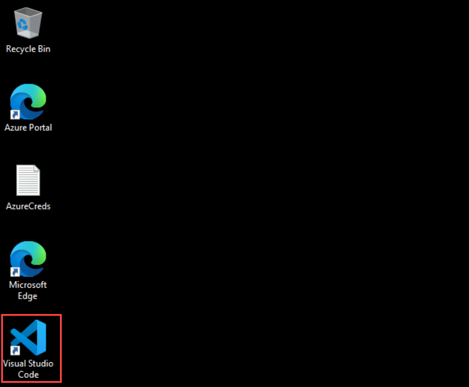
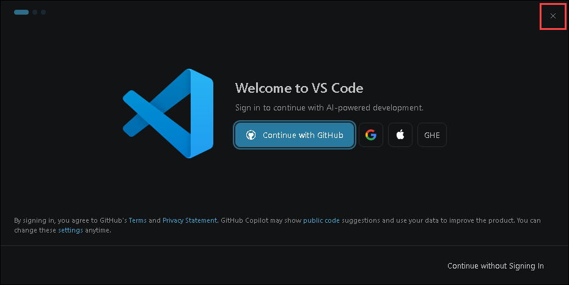
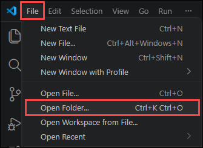
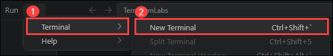

# Exercise 01: Getting Started with Microsoft Foundry & AI Agents 

## Scenario

## Overview

## Objectives

In this exercise, you will complete the following tasks:

- Task 1: Environment & Microsoft Foundry Setup 
- Task 2: Agent Basics & Code Interpreter
- Task 3: File Search & Bing Grounding
- Task 4: Enterprise Search, MCP Tools & Foundry IQ

## Task 1: Environment & Microsoft Foundry Setup

1. Open **Visual Studio Code** on your Lab-VM.

   

1. Once the IDE opens, if you see the ***Welcome to VS Code*** sign-in pop-up for GitHub, simply close the window by clicking the **X** in the upper-right corner.

   

1. From the **File** menu in VS Code, choose **Open Folder**.

   

1. Select the **C:\Users\azureuser\agentic-ai-immersion** folder and click **Select folder**.

   

1. Now you will see another screen Do you trust the authors of the files in this folder?. Select the **checkbox (1)** *Trust the authors of all files in the parent folder 'azureuser'* and then click **Yes, I trust the authors (2)**.

   

1. Open the integrated terminal by selecting **Terminal → New Terminal**.

   

1. In the integrated terminal, verify that Python is installed by running the following command:

   ```bash
   python --version
   ```

1. 
