# Exercise 03: Observability & Evaluation 

## Scenario

## Overview

## Objectives

In this exercise, you will complete the following tasks:

- Task 1: Telemetry & Monitoring 
- Task 2: Agent & Tool Evaluation

## Task 1: Telemetry & Monitoring 

### **`observability-and-evaluations/1-telemetry.ipynb`**

1. Open `observability-and-evaluations/1-telemetry.ipynb`

   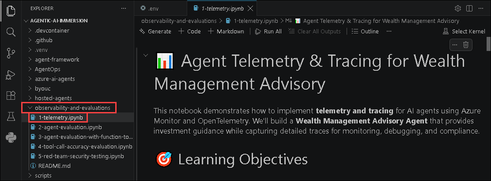

1. This notebook demonstrates how to implement **Telemetry** and **Tracing** for a **Wealth Management Advisory Agent** using **Azure Monitor** and `OpenTelemetry`. You'll learn how to capture agent interactions, create custom trace spans, and monitor application behavior to support observability, compliance, and troubleshooting.

   - Configure Azure Monitor for AI agent telemetry.
   - Enable content recording to capture prompts and responses.
   - Create custom trace spans using `OpenTelemetry`.
   - View and analyze traces in Microsoft Foundry and Application Insights.
   - Build observable AI applications using production-ready monitoring and compliance practices.
  
1. In the notebook, select **Select Kernel** from the upper-right corner, and then choose the **Python 3.14.*** kernel.

   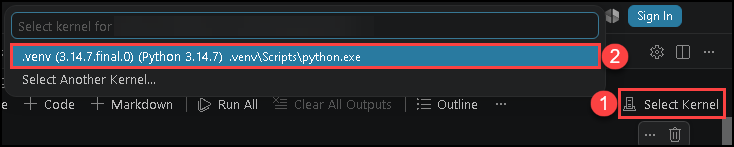

1. Run all the cells individually to set up and build an **Observable Wealth Management Advisory Agent** with **Telemetry** and **Tracing**.

1. After running all the cells in the notebook, you will have successfully built an **Observable Wealth Management Advisory Agent** that can:

   - Capture telemetry and distributed traces for AI agent interactions.
   - Record prompts and responses for monitoring and auditing.
   - Create custom trace spans to track business-specific operations.
   - Monitor agent behavior through Microsoft Foundry and Application Insights.
   - Implement production-ready observability practices for compliance, diagnostics, and performance monitoring.

1. In the notebook, locate the **8. Retrieve and Display Trace Information** cell and note down the **Trace ID**. You will use this Trace ID to view the traces in Azure portal.

   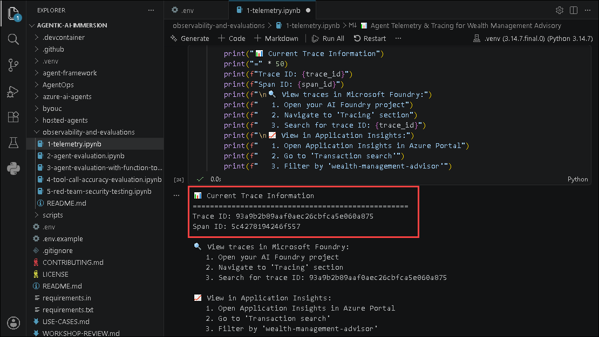

1. Navigate back to your **Application Insights** resource in the Azure portal, enter the **Trace ID** in the search bar **(1)**, and then select the corresponding agent **Trace (2)** to view the agent traces.

   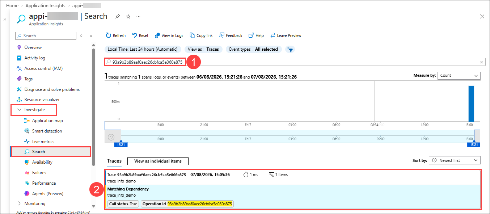
  
## Task 2: Agent & Tool Evaluation

### **`observability-and-evaluations/2-agent-evaluation.ipynb`**

1. Open `observability-and-evaluations/2-agent-evaluation.ipynb`

   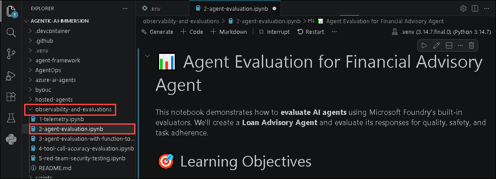

1. This notebook demonstrates how to evaluate a **Financial Advisory Agent** using **Microsoft Foundry's built-in evaluators**. You'll learn how to assess agent responses for quality, safety, and instruction adherence to ensure reliable and compliant AI behavior in financial services.

   - Create and configure a Financial Advisory AI agent.
   - Configure built-in evaluators to assess agent responses.
   - Run evaluations against representative financial queries.
   - Analyze evaluation results for quality, safety, and task adherence.
   - Build production-ready evaluation workflows for responsible AI applications.
  
1. In the notebook, select **Select Kernel** from the upper-right corner, and then choose the **Python 3.14.*** kernel.

   

1. Run all the cells individually to set up, build, and evaluate your **Financial Advisory Agent** using **Microsoft Foundry Evaluators**.

1. After running all the cells in the notebook, you will have successfully built and evaluated a **Financial Advisory Agent** that can:

   - Generate responses to financial advisory and loan-related queries.
   - Evaluate responses using built-in quality and safety evaluators.
   - Measure fluency, task adherence, and content safety.
   - Analyze evaluation results to identify areas for improvement.
   - Demonstrate production-ready AI evaluation practices for financial services applications.
  
1. Navigate to the **Microsoft Foundry** portal, select the **Build** tab, and then, from the left navigation pane, click **Evaluations (1)** and select **Loan Advisory Agent Evaluation (2)**.

    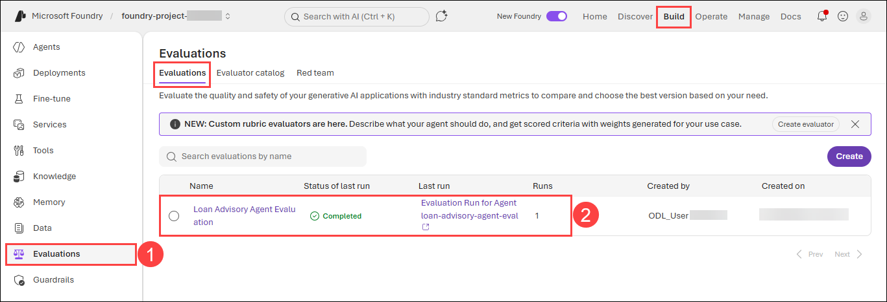

1. In the selected evaluation, choose the **Evaluation run** to view the evaluation metrics and results.

   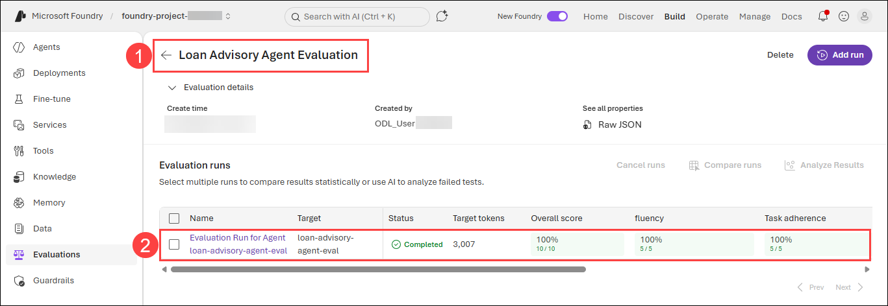

### **`observability-and-evaluations/3-agent-evaluation-with-function-tools.ipynb`**

1. Open `observability-and-evaluations/3-agent-evaluation-with-function-tools.ipynb`

   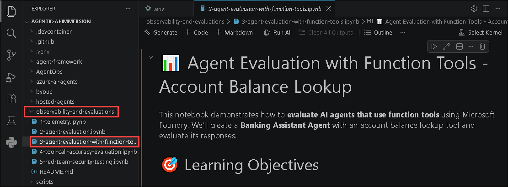

1. This notebook demonstrates how to evaluate a **Banking Assistant Agent** that uses Function Tools with **Microsoft Foundry Evaluators**. You'll learn how to integrate custom function tools, handle tool calls during agent execution, and evaluate both the quality of responses and the correctness of tool usage.

   - Create and integrate function tools with an Azure AI agent.
   - Handle function calls and process tool outputs during agent execution.
   - Build a banking assistant with account balance lookup capabilities.
   - Evaluate tool-enabled agent responses using Microsoft Foundry evaluators.
   - Assess response quality, tool usage, and responsible AI practices.
  
1. In the notebook, select **Select Kernel** from the upper-right corner, and then choose the **Python 3.14.*** kernel.

   

1. Run all the cells individually to set up, build, and evaluate your **Banking Assistant Agent** with **Function Tools**.

1. After running all the cells in the notebook, you will have successfully built and evaluated a **Banking Assistant Agent** that can:

   - Invoke function tools to perform account balance lookups.
   - Process tool outputs and generate accurate banking responses.
   - Evaluate agent responses and function tool interactions.
   - Verify correct tool invocation and response quality.
   - Demonstrate production-ready evaluation practices for tool-enabled AI agents in financial services.
  
1. Navigate to the **Microsoft Foundry** portal, select the **Build** tab, and then, from the left navigation pane, click **Evaluations (1)** and select **Agent Response Evaluation with Tools (2)**.

    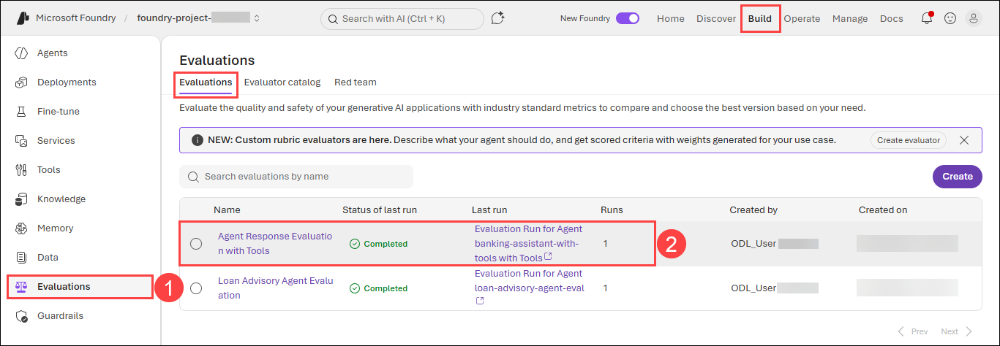

1. In the selected evaluation, choose the **Evaluation run** to view the evaluation metrics and results.

   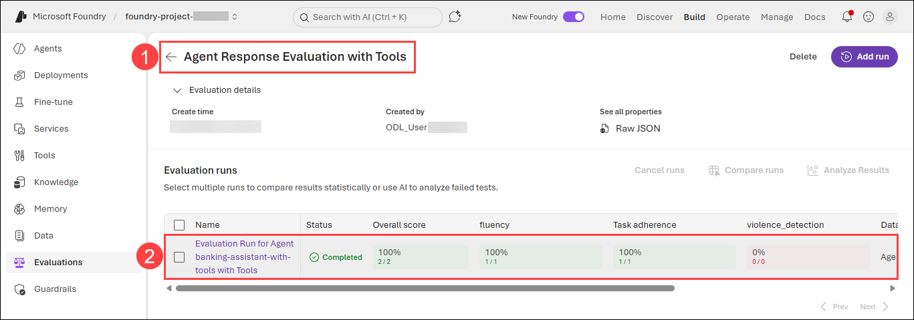

### **`observability-and-evaluations/4-tool-call-accuracy-evaluation.ipynb`**

1. Open `observability-and-evaluations/4-tool-call-accuracy-evaluation.ipynb`

   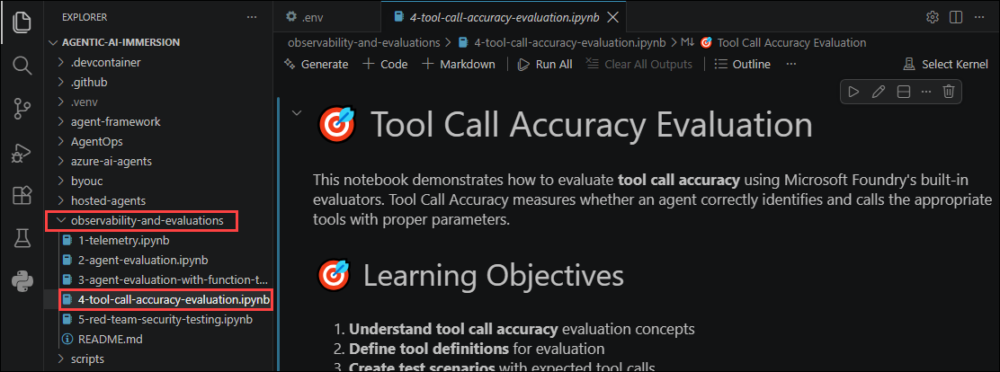

1. This notebook demonstrates how to evaluate **Tool Call Accuracy** using **Microsoft Foundry Evaluators**. You'll learn how to verify whether an AI agent selects the correct function tools and supplies the appropriate parameters when responding to user requests.

   - Understand the concepts of Tool Call Accuracy evaluation.
   - Define tool schemas and expected tool calls for evaluation.
   - Create test scenarios with expected tool invocations.
   - Evaluate whether agents select the correct tools and parameters.
   - Build production-ready evaluation workflows for tool-enabled AI agents.
  
1. In the notebook, select **Select Kernel** from the upper-right corner, and then choose the **Python 3.14.*** kernel.

   

1. Run all the cells individually to set up and evaluate **Tool Call Accuracy** for your **Banking AI Agent**.

1. After running all the cells in the notebook, you will have successfully evaluated a **Banking AI Agent** that can:

   - Select the appropriate function tools for banking operations.
   - Invoke tools with the correct parameters based on user requests.
   - Validate tool selection against expected outcomes.
   - Measure tool call accuracy using Microsoft Foundry evaluators.
   - Demonstrate production-ready evaluation practices for reliable and compliant tool-enabled AI applications.
  
1. Navigate to the **Microsoft Foundry** portal, select the **Build** tab, and then, from the left navigation pane, click **Evaluations (1)** and select **Banking Tool Call Accuracy Evaluation (2)**.

    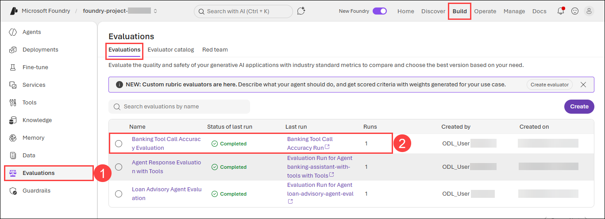

1. In the selected evaluation, choose the **Evaluation run** to view the evaluation metrics and results.

   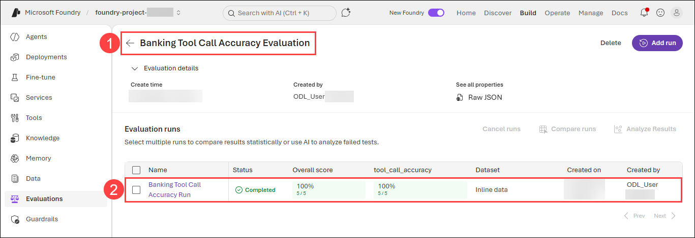

