# Exercise 04: Bring Your Own Use Case with GitHub Copilot

## Scenario

## Overview

## Objectives

In this exercise, you will complete the following tasks:

- Task 1: Login to GitHub & Complete the Use Case Spec  
- Task 2: Generate a Plan with GitHub Copilot 
- Task 3: Scaffold the Agent with Copilot Agent Mode 
- Task 4: Explore Use Cases

## Task 1: Login to GitHub & Complete the Use Case Spec

1. In Visual Studio Code, click on the **Icon (1)** in the GitHub Copilot Chat panel located at the bottom-right corner of the window, and select **Use AI Features (2)**.

   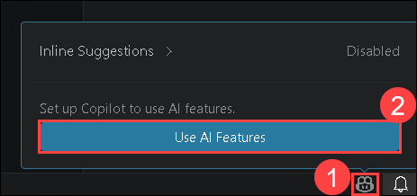

1. On the *Sign in to use GitHub Copilot* screen, select **Continue with GitHub** to sign in.
  
   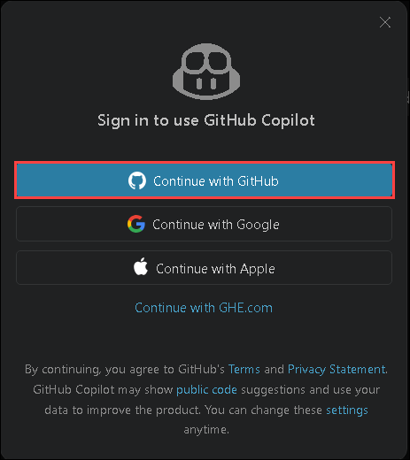

1. On the **Sign in to GitHub** tab, enter the provided **GitHub username** in the input field, and click on **Sign in with your identity provider** **(2)**.

    - **Email/Username:** <inject key="GitHub User Name" enableCopy="true"/> **(1)**

       

1. Click on **Continue** on the **Single sign-on to CloudLabs Organizations** page to proceed.

   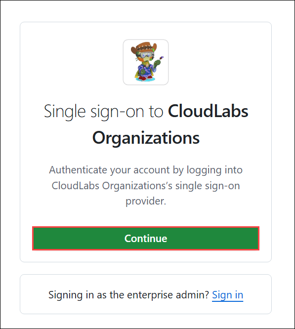

1. You'll see the **Sign in** tab. Here, enter your Azure Entra credentials and click **Next (2)**.

   - **Email/Username:** <inject key="AzureAdUserEmail"></inject> **(1)**

     

1. Next, provide your Temporary Password and click on **Sign in (2)**

   - **Temporary Access Pass:** <inject key="AzureAdUserPassword"></inject> **(1)**

     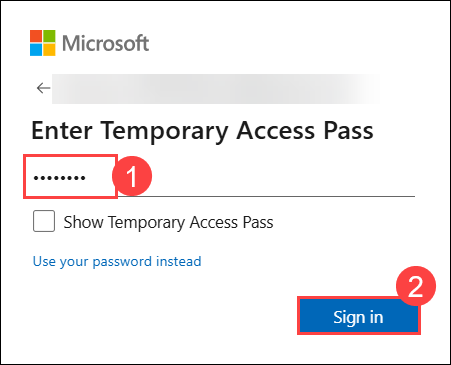

1. On the **Permissions requested by:** tab, click on **Accept**.

    

1. On the **Stay Signed in?** pop-up, click on No.

   

1. On the next window, click on **Authorize Visual Studio Code**.

   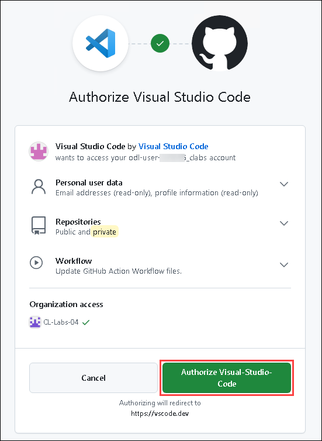

1. You will see a pop-up asking **This site is trying to open Visual Studio Code**. Enable the **CheckBox (1)** and then click on **Open (2)**. It will take you to VS Code. 

   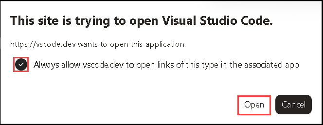
   
1. In Visual Studio Code, open the `byouc/Agentic_UseCase_Spec.md` template, define your agent use case, and then use GitHub Copilot to scaffold a complete agent MVP based on the completed specification.

   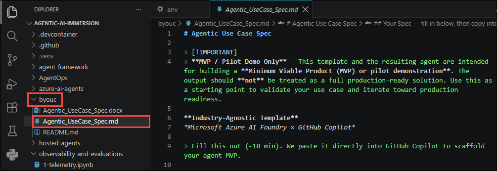

   > **This Specification Template Covers**
   > 1. **Use Case Summary** — what the agent does and what problem it solves
   > 2. **Input** — data type, structure, and size
   > 3. **Agent Steps** — the tools your agent will use (step-by-step)
   > 4. **Output** — expected format and severity/category levels
   > 5. **Behavior Rules** — MUST and MUST NOT constraints
   > 6. **Domain Context** — key terms and agent persona
   > 7. **Preferences** — Notebook or Web app UI
   > 8. **Synthetic Data Requirements** — test data spec (Copilot generates the data)

1. For this workshop, you will use the sample **Loan Application Risk Reviewer** agent specification. Review the specification below carefully, as you will use it to generate an implementation plan for the agent in the next task.

   ```
   ### Use Case Summary

   - **Use case name:** "Loan Application Risk Reviewer"
   - **What it does:** "Reviews retail/SME loan applications against credit policy and flags exceptions with risk severity and remediation guidance"
   - **Problem it solves:** "Credit analysts spend 45 min per application manually checking 30+ policy parameters — error rate is 12%"

   ### Input

   - **Input type:** PDF + spreadsheet
   - **What it looks like:** Loan application form with: applicant details, income docs, CIBIL/credit score, collateral details, existing liabilities, bank statements
   - **Typical size:** 10–25 pages + 3–6 months statements

   ### Agent Steps

   1. Extract applicant details, income, liabilities, and collateral from the application PDF
   2. Parse bank statements and compute average monthly balance, salary credits, and EMI outflows
   3. Calculate key ratios: FOIR (Fixed Obligation to Income Ratio), LTV (Loan-to-Value), DSCR (Debt Service Coverage Ratio)
   4. Check each parameter against credit policy thresholds (e.g., FOIR ≤ 60%, LTV ≤ 80%)
   5. Flag policy exceptions with severity (Critical / High / Medium) and cite the specific policy clause
   6. Generate a risk summary with overall recommendation: Approve / Refer to Credit Committee / Decline

   ### Output

   - **Output format:** Policy exception report: parameter, policy threshold, actual value, breach severity, clause reference. Overall: Approve / Refer / Decline
   - **Severity levels:** Critical (auto-decline) / High (committee referral) / Medium (waiver possible) / Low (observation)

   ### Agent Behavior Rules

   **MUST:**
   - Cite the exact credit policy clause number for every exception flagged
   - Calculate FOIR, LTV, DSCR from source data — never accept pre-calculated values without verification
   - Flag if total exposure (existing + proposed) exceeds single-borrower limit

   **MUST NOT:**
   - Make a final credit decision — only recommend (Approve / Refer / Decline)
   - Ignore missing income documentation — flag as Critical, never infer income
   - Use external data sources — work only with the provided application package

   ### Domain Context

   - **Key terms:** FOIR, LTV, DSCR, NPA, CIBIL score, EMI, collateral coverage, single-borrower limit
   - **Agent persona:** "Senior credit analyst with 10 years in retail/SME lending"

   ### Synthetic Data Requirements

   *Example — Loan Application Reviewer:*

   | Attribute | Example Spec |
   |---|---|
   | Number of test samples | 1 synthetic loan application (clean / approvable happy-path) |
   | Required fields / structure | Applicant: name, age, employment type (salaried/self-employed), monthly income, existing debt payments, FICO score (300-850). Loan: amount, tenure, type (home/personal/vehicle). Collateral: type, market value, forced-sale value. Bank statements: 6 months of transactions with salary credits, debt payment debits, average balance. |
   | Realistic value ranges | Income: $3K-$15K/month. FICO: 670-800 (good), 580-669 (fair), <580 (poor). FOIR threshold: 60%. LTV threshold: 80%. Loan amounts: $50K-$2M. |
   | Edge cases to include | None for the default sample — keep it a clean happy-path approval. |
   | File format | JSON or structured dict (simulating parsed PDF output). Bank statements as list of transaction dicts. |
   ```

## Task 2: Generate a Plan with GitHub Copilot

1. In Visual Studio Code, open the **GitHub Copilot Chat** window, and then switch to **Plan** mode from the **Set Agent** menu.

   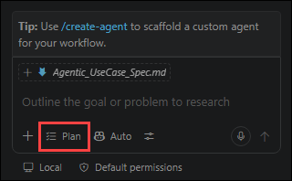

1. In **GitHub Copilot Chat**, ensure **Plan** mode is selected, paste your completed agent specification along with the wrapper prompt below and then hit **Send** (or click **Enter**). GitHub Copilot will generate a detailed implementation plan without writing any code.

   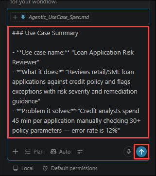

   ```
   You are a senior Python architect. Build a detailed implementation plan for a Microsoft Foundry agent MVP based on this use case spec.

   IMPORTANT CONSTRAINTS — follow these exactly:
   1. Create a NEW folder at the repository root level named after the use case (e.g., `my-use-case/`). All generated code MUST go in this folder.
   2. Do NOT create a new virtual environment. Reuse the existing `.venv` at the repo root (already activated).
   3. Before planning, study the existing code in this repository for reference patterns.
   4. Match the SDK patterns, imports, auth, and .env loading conventions already used in this repo.

   Tech stack (must use):
   - Python 3.12
   - azure-ai-projects SDK (AIProjectClient, PromptAgentDefinition, WorkflowAgentDefinition)
   - OpenAI Responses API (responses.create with agent_reference + conversation)
   - AzureCliCredential for authentication
   - If user chose "Web app" in §7: build a web UI using Gradio, FastAPI, or similar framework
   - If user chose "Notebook" in §7: create a single Jupyter notebook (.ipynb) with all code in runnable cells so the user can execute it top-to-bottom and see results inline
   - FunctionTool definitions with Annotated type hints and Pydantic Field descriptions
   - dotenv for environment variable loading (AI_FOUNDRY_PROJECT_ENDPOINT, AZURE_AI_MODEL_DEPLOYMENT_NAME, TENANT_ID)

   Plan deliverables — output a numbered plan covering:
   a) Folder structure under the new root-level folder (e.g., `<use-case-name>/src/`, `<use-case-name>/tests/`, etc.)
   b) Each Python module to create: filename, purpose, key classes/functions
   c) Agent definitions: system prompt, tools (JSON schemas + implementations), model config
   d) Workflow orchestration: sequential/parallel agent steps, data flow between agents
   e) If Web app: UI framework choice, layout, input/output components, event handlers
      If Notebook: cell-by-cell breakdown — setup, agent creation, invocation, results display
   f) Requirements: only list NEW packages not already in the repo's requirements.txt
   g) .env variables needed (reuse existing ones where possible)

   Use the synthetic test data from §8 to plan how the agent will be validated with a single happy-path test.

   Do NOT write code yet — only produce the plan. I will implement in the next step.

   ### Use Case Summary

   - **Use case name:** "Loan Application Risk Reviewer"
   - **What it does:** "Reviews retail/SME loan applications against credit policy and flags exceptions with risk severity and remediation guidance"
   - **Problem it solves:** "Credit analysts spend 45 min per application manually checking 30+ policy parameters — error rate is 12%"

   ### Input

   - **Input type:** PDF + spreadsheet
   - **What it looks like:** Loan application form with: applicant details, income docs, CIBIL/credit score, collateral details, existing liabilities, bank statements
   - **Typical size:** 10–25 pages + 3–6 months statements

   ### Agent Steps

   1. Extract applicant details, income, liabilities, and collateral from the application PDF
   2. Parse bank statements and compute average monthly balance, salary credits, and EMI outflows
   3. Calculate key ratios: FOIR (Fixed Obligation to Income Ratio), LTV (Loan-to-Value), DSCR (Debt Service Coverage Ratio)
   4. Check each parameter against credit policy thresholds (e.g., FOIR ≤ 60%, LTV ≤ 80%)
   5. Flag policy exceptions with severity (Critical / High / Medium) and cite the specific policy clause
   6. Generate a risk summary with overall recommendation: Approve / Refer to Credit Committee / Decline

   ### Output

   - **Output format:** Policy exception report: parameter, policy threshold, actual value, breach severity, clause reference. Overall: Approve / Refer / Decline
   - **Severity levels:** Critical (auto-decline) / High (committee referral) / Medium (waiver possible) / Low (observation)

   ### Agent Behavior Rules

   **MUST:**
   - Cite the exact credit policy clause number for every exception flagged
   - Calculate FOIR, LTV, DSCR from source data — never accept pre-calculated values without verification
   - Flag if total exposure (existing + proposed) exceeds single-borrower limit

   **MUST NOT:**
   - Make a final credit decision — only recommend (Approve / Refer / Decline)
   - Ignore missing income documentation — flag as Critical, never infer income
   - Use external data sources — work only with the provided application package

   ### Domain Context

   - **Key terms:** FOIR, LTV, DSCR, NPA, CIBIL score, EMI, collateral coverage, single-borrower limit
   - **Agent persona:** "Senior credit analyst with 10 years in retail/SME lending"

   ### Synthetic Data Requirements

   *Example — Loan Application Reviewer:*

   | Attribute | Example Spec |
   |---|---|
   | Number of test samples | 1 synthetic loan application (clean / approvable happy-path) |
   | Required fields / structure | Applicant: name, age, employment type (salaried/self-employed), monthly income, existing debt payments, FICO score (300-850). Loan: amount, tenure, type (home/personal/vehicle). Collateral: type, market value, forced-sale value. Bank statements: 6 months of transactions with salary credits, debt payment debits, average balance. |
   | Realistic value ranges | Income: $3K-$15K/month. FICO: 670-800 (good), 580-669 (fair), <580 (poor). FOIR threshold: 60%. LTV threshold: 80%. Loan amounts: $50K-$2M. |
   | Edge cases to include | None for the default sample — keep it a clean happy-path approval. |
   | File format | JSON or structured dict (simulating parsed PDF output). Bank statements as list of transaction dicts. |
   ```

1. GitHub Copilot will analyze your completed agent specification, validate the requirements, and generate a detailed implementation plan outlining the project structure, agent workflow, components, and implementation approach. Once the plan is generated, review it to ensure it accurately reflects your agent use case. You will use this plan to scaffold the complete agent MVP in the next task.

## Task 3: Scaffold the Agent with Copilot Agent Mod

1. After reviewing the implementation plan, switch **GitHub Copilot Chat** to **Agent** mode.
   
   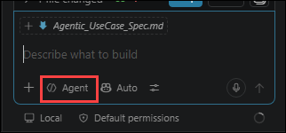

1. Paste the implementation prompt below along with the generated plan and then hit **Send** (or click **Enter**).

   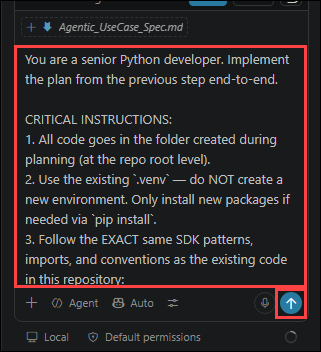

   ```
   You are a senior Python developer. Implement the plan from the previous step end-to-end.

   CRITICAL INSTRUCTIONS:
   1. All code goes in the folder created during planning (at the repo root level).
   2. Use the existing `.venv` — do NOT create a new environment. Only install new packages if needed via `pip install`.
   3. Follow the EXACT same SDK patterns, imports, and conventions as the existing code in this repository:
      - Use `AIProjectClient` from `azure.ai.projects` for agent management
      - Use `PromptAgentDefinition` / `WorkflowAgentDefinition` for agent definitions
      - Use `openai_client.responses.create()` with `agent_reference` for invocation
      - Use `AzureCliCredential` for authentication
      - Load env vars with `dotenv` using relative path resolution: `load_dotenv(Path().absolute().parent / '.env')`
      - Define tools as Python functions with `Annotated[type, Field(description="...")]` parameters
   4. Implement EVERY module from the plan — do not skip any file.
      - If the plan specifies a Web app: build the web UI (Gradio, FastAPI, etc.) as a standalone Python app.
      - If the plan specifies a Notebook: create a single .ipynb notebook with all code organized in runnable cells (setup, agent creation, tool definitions, invocation, results display). The user will run the notebook top-to-bottom to see the agent in action.
   5. After writing all code, create a `run_tests.py` script in the use-case folder that:
      - Tests each tool function independently with sample input data
      - Tests agent creation and basic invocation
      - Tests the full end-to-end workflow with a happy-path scenario
      - Prints clear PASS/FAIL results for each test
   6. Create a `README.md` in the use-case folder with:
      - Setup instructions (referencing the existing .venv)
      - How to run the agent
      - How to run tests
      - Architecture overview

   After implementation, run the tests and fix any issues until all tests pass.
   ```

1. GitHub Copilot will scaffold the complete agent MVP, including the project structure, source code, tests, and supporting documentation.

   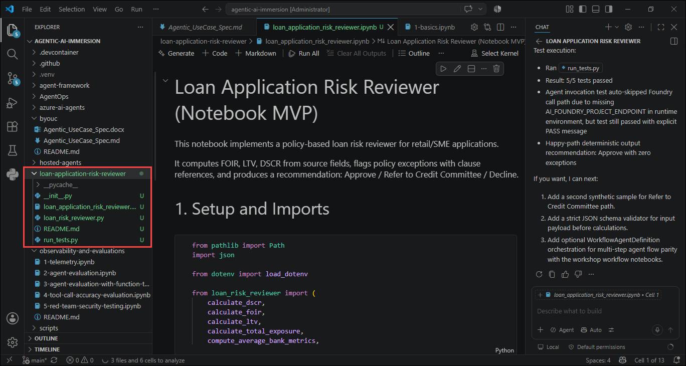

1. Open the newly created notebook that contains the **Loan Application Risk Reviewer** agent implementation.

   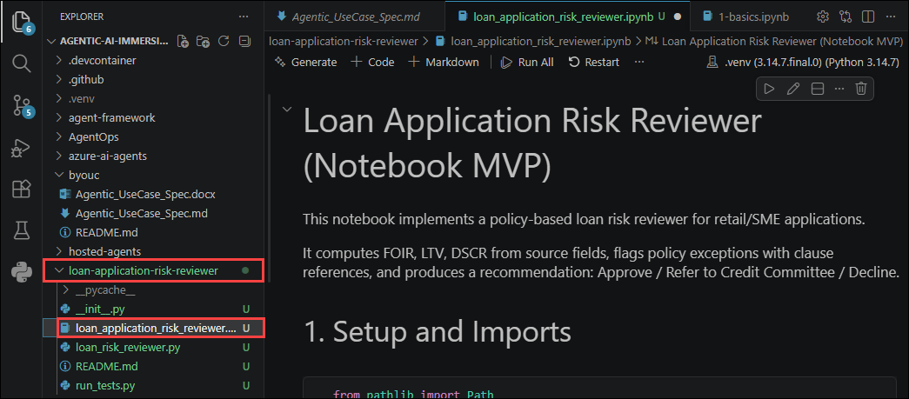

1. This notebook demonstrates how to build a **Loan Application Risk Reviewer Agent** using a policy-based approach for retail and SME lending. The solution calculates key credit risk metrics, evaluates applications against predefined lending policies, identifies policy exceptions with clause references, and generates a risk-based lending recommendation.

   - Calculate key lending metrics such as FOIR, LTV, and DSCR from application data.
   - Evaluate loan applications against predefined credit policies.
   - Identify and flag policy exceptions with corresponding clause references.
   - Generate risk-based recommendations to Approve, Refer to Credit Committee, or Decline applications.
   - Build a production-ready loan risk assessment workflow using responsible decisioning practices.

1. In the notebook, select **Select Kernel** from the upper-right corner, and then choose the **Python 3.14.*** kernel.

   

1. Run all the cells individually to set up and build your **Loan Application Risk Reviewer Agent**.

1. After running all the cells in the notebook, you will have successfully built a **Loan Application Risk Reviewer Agent** that can:

   - Calculate FOIR, LTV, and DSCR from loan application data.
   - Evaluate applications against predefined credit and lending policies.
   - Detect and report policy exceptions with relevant clause references.
   - Generate consistent lending recommendations based on calculated risk.
   - Demonstrate production-ready, policy-driven loan risk assessment for retail and SME lending.

1. Navigate to the Microsoft Foundry portal. From the **Build** tab, select **Agents (1)** in the left navigation pane to view your newly created **Loan Application Risk Reviewer (2)** agent, which was scaffolded by **GitHub Copilot**.

   > **Note:** You can also view all the other agents that were created during this workshop.

   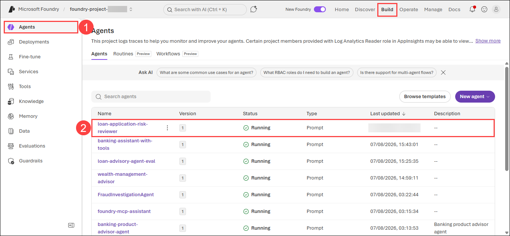
   
## Task 4: Explore Use Cases

This workshop features **57 real-world FSI use cases** across all notebooks, demonstrating practical AI agent applications for enterprise banking, insurance, and investment scenarios.

| Use Case | Description | Technology | Notebook |
|----------|-------------|------------|----------|
| Financial Services Advisor | General banking, loan, and investment guidance with regulatory disclaimers | Azure AI Agents v2 | [1-basics.ipynb](https://github.com/dhangerkapil/agentic-ai-immersion/blob/main/azure-ai-agents/1-basics.ipynb) |
| Loan & Portfolio Calculator | Calculates loan payments, amortization schedules, analyzes financial data | Azure AI Agents v2, Code Interpreter | [2-code-interpreter.ipynb](https://github.com/dhangerkapil/agentic-ai-immersion/blob/main/azure-ai-agents/2-code-interpreter.ipynb) |
| Banking Document Search | Search loan policies, banking regulations, and compliance documents | Azure AI Agents v2, File Search | [3-file-search.ipynb](https://github.com/dhangerkapil/agentic-ai-immersion/blob/main/azure-ai-agents/3-file-search.ipynb) |
| Financial Market Research | Real-time market trends, interest rates, and financial news | Azure AI Agents v2, WebSearchTool | [4-web-search.ipynb](https://github.com/dhangerkapil/agentic-ai-immersion/blob/main/azure-ai-agents/4-web-search.ipynb) |
| Banking Products Catalog | Semantic search across banking products (loans, credit cards, accounts) | Azure AI Agents v2, Azure AI Search | [5-agents-aisearch.ipynb](https://github.com/dhangerkapil/agentic-ai-immersion/blob/main/azure-ai-agents/5-agents-aisearch.ipynb) |
| Insurance Claims Processing | Automated claims assessment, validation, and payout decisions | Azure AI Agents v2, Multi-Agent Workflows | [6-multi-agent-solution-with-workflows.ipynb](https://github.com/dhangerkapil/agentic-ai-immersion/blob/main/azure-ai-agents/6-multi-agent-solution-with-workflows.ipynb) |
| Platform Operations Assistant | Model discovery, deployment management, evaluation creation | Azure AI Agents v2, Foundry MCP Server | [7-mcp-tools.ipynb](https://github.com/dhangerkapil/agentic-ai-immersion/blob/main/azure-ai-agents/7-mcp-tools.ipynb) |
| Multi-Source Fraud Investigation | Investigate fraud using patterns, regulations, and procedures | Azure AI Agents v2, Foundry IQ | [8-foundry-IQ-agents.ipynb](https://github.com/dhangerkapil/agentic-ai-immersion/blob/main/azure-ai-agents/8-foundry-IQ-agents.ipynb) |
| Personalized Banking Assistant | Remembers customer preferences for personalized guidance | Azure AI Agents v2, Memory Search | [9-agent-memory-search.ipynb](https://github.com/dhangerkapil/agentic-ai-immersion/blob/main/azure-ai-agents/9-agent-memory-search.ipynb) |
| Scheduled Compliance Monitor | Run a benefits-compliance agent automatically on a daily schedule | Azure AI Agents v2, Routines (preview) | [11-routines.ipynb](https://github.com/dhangerkapil/agentic-ai-immersion/blob/main/azure-ai-agents/11-routines.ipynb) |
| Personalized Benefits Memory | Long-term client-preference memory across sessions | Azure AI Agents v2, Memory Stores (preview) | [12-agent-memory.ipynb](https://github.com/dhangerkapil/agentic-ai-immersion/blob/main/azure-ai-agents/12-agent-memory.ipynb) |
| Cost-Optimized Loan Triage | Route simple vs. complex requests to cheap/strong models | Azure AI Agents v2, Model Router | [13-model-router.ipynb](https://github.com/dhangerkapil/agentic-ai-immersion/blob/main/azure-ai-agents/13-model-router.ipynb) |
| Specialist Delegation | One agent delegates detailed work to another over A2A | Azure AI Agents v2, Agent-to-Agent (preview) | [14-agent-to-agent-a2a.ipynb](https://github.com/dhangerkapil/agentic-ai-immersion/blob/main/azure-ai-agents/14-agent-to-agent-a2a.ipynb) |
| Docs-Grounded Benefits Agent | Ground answers in documentation via a managed MCP server | Azure AI Agents v2, Managed MCP (preview) | [15-managed-mcp-connectors.ipynb](https://github.com/dhangerkapil/agentic-ai-immersion/blob/main/azure-ai-agents/15-managed-mcp-connectors.ipynb) |
| Employee Benefits Review (hosted) | Structured benefits review via the Invocations protocol | Agent Framework, Hosted Agent | [benefits-review-invocations](https://github.com/dhangerkapil/agentic-ai-immersion/blob/main/hosted-agents/benefits-review-invocations) |
| Employee Benefits Advisor (hosted) | Conversational advisor with Foundry Toolbox + Skills (Responses) | Agent Framework, Hosted Agent | [benefits-advisor-responses](https://github.com/dhangerkapil/agentic-ai-immersion/blob/main/hosted-agents/benefits-advisor-responses) |
| Benefits Agent GitOps Pipeline | Build, deploy, and operate a hosted agent via GitHub Actions | AgentOps, GitOps | [AgentOps](https://github.com/dhangerkapil/agentic-ai-immersion/blob/main/AgentOps) |
| Financial Advisor Basics | Banking operations with account balance and loan inquiries | Agent Framework, Azure AI Agents | [1-azure-ai-basic.ipynb](https://github.com/dhangerkapil/agentic-ai-immersion/blob/main/agent-framework/agents/azure-ai-agents/1-azure-ai-basic.ipynb) |
| Investment Portfolio Management | Configurable advisor with portfolio allocation recommendations | Agent Framework, Explicit Settings | [2-azure-ai-with-explicit-settings.ipynb](https://github.com/dhangerkapil/agentic-ai-immersion/blob/main/agent-framework/agents/azure-ai-agents/2-azure-ai-with-explicit-settings.ipynb) |
| Persistent Financial Advisor | Reusable banking agent retaining configuration across sessions | Agent Framework, Existing Agent | [3-azure-ai-with-existing-ai-agent.ipynb](https://github.com/dhangerkapil/agentic-ai-immersion/blob/main/agent-framework/agents/azure-ai-agents/3-azure-ai-with-existing-ai-agent.ipynb) |
| Banking Operations Center | Account management, transaction history, loan calculations | Agent Framework, Function Tools | [4-azure-ai-with-function-tools.ipynb](https://github.com/dhangerkapil/agentic-ai-immersion/blob/main/agent-framework/agents/azure-ai-agents/4-azure-ai-with-function-tools.ipynb) |
| Financial Analytics Dashboard | Portfolio analysis, compound interest, loan amortization | Agent Framework, Code Interpreter | [5-azure-ai-with-code-interpreter.ipynb](https://github.com/dhangerkapil/agentic-ai-immersion/blob/main/agent-framework/agents/azure-ai-agents/5-azure-ai-with-code-interpreter.ipynb) |
| Loan Policy Document Search | Q&A over loan policies and compliance documents | Agent Framework, File Search | [6-azure-ai-with-file-search.ipynb](https://github.com/dhangerkapil/agentic-ai-immersion/blob/main/agent-framework/agents/azure-ai-agents/6-azure-ai-with-file-search.ipynb) |
| Financial Market Research Portal | Real-time stock news, economic trends, market information | Agent Framework, WebSearchTool | [7-azure-ai-with-web-search.ipynb](https://github.com/dhangerkapil/agentic-ai-immersion/blob/main/agent-framework/agents/azure-ai-agents/7-azure-ai-with-web-search.ipynb) |
| Documentation Research Assistant | Query external documentation via cloud-hosted tools | Agent Framework, Hosted MCP | [8-azure-ai-with-hosted-mcp.ipynb](https://github.com/dhangerkapil/agentic-ai-immersion/blob/main/agent-framework/agents/azure-ai-agents/8-azure-ai-with-hosted-mcp.ipynb) |
| Loan Application Discussion | Multi-turn conversations for loan applications and planning | Agent Framework, Thread Management | [9-azure-ai-with-existing-multi-turn-thread.ipynb](https://github.com/dhangerkapil/agentic-ai-immersion/blob/main/agent-framework/agents/azure-ai-agents/9-azure-ai-with-existing-multi-turn-thread.ipynb) |
| Customer KYC Profile Collection | Collect and track customer identification for compliance | Agent Framework, Context Providers | [1-simple-context-provider.ipynb](https://github.com/dhangerkapil/agentic-ai-immersion/blob/main/agent-framework/context-providers/1-simple-context-provider.ipynb) |
| Loan Underwriting & Risk Assessment | Review underwriting guidelines with intelligent reasoning | Agent Framework, Azure AI Search (Agentic), Foundry IQ | [2-azure-ai-search-context-agentic.ipynb](https://github.com/dhangerkapil/agentic-ai-immersion/blob/main/agent-framework/context-providers/2-azure-ai-search-context-agentic.ipynb) |
| Transaction Compliance Monitoring | Monitor transactions for regulatory violations with audit logs | Agent Framework, Agent Middleware | [1-agent-and-run-level-middleware.ipynb](https://github.com/dhangerkapil/agentic-ai-immersion/blob/main/agent-framework/middleware/1-agent-and-run-level-middleware.ipynb) |
| Trade Execution Logging | Track trade execution timing for regulatory reporting | Agent Framework, Function Middleware | [2-function-based-middleware.ipynb](https://github.com/dhangerkapil/agentic-ai-immersion/blob/main/agent-framework/middleware/2-function-based-middleware.ipynb) |
| Credit Limit Assessment | Assess credit limits with PII protection and request counting | Agent Framework, Class Middleware | [3-class-based-middleware.ipynb](https://github.com/dhangerkapil/agentic-ai-immersion/blob/main/agent-framework/middleware/3-class-based-middleware.ipynb) |
| Portfolio Rebalancing | Manage portfolio changes with trading window checks | Agent Framework, Decorator Middleware | [4-decorator-middleware.ipynb](https://github.com/dhangerkapil/agentic-ai-immersion/blob/main/agent-framework/middleware/4-decorator-middleware.ipynb) |
| Customer Service Message Filtering | Audit logging, PII redaction, sensitive query blocking | Agent Framework, Chat Middleware | [5-chat-middleware.ipynb](https://github.com/dhangerkapil/agentic-ai-immersion/blob/main/agent-framework/middleware/5-chat-middleware.ipynb) |
| Market Data Service Recovery | Handle external service failures with graceful fallbacks | Agent Framework, Exception Handling | [6-exception-handling-with-middleware.ipynb](https://github.com/dhangerkapil/agentic-ai-immersion/blob/main/agent-framework/middleware/6-exception-handling-with-middleware.ipynb) |
| Transaction Compliance Screening | Block prohibited transactions and rate limit requests | Agent Framework, Termination Logic | [7-middleware-termination.ipynb](https://github.com/dhangerkapil/agentic-ai-immersion/blob/main/agent-framework/middleware/7-middleware-termination.ipynb) |
| Market Data Enrichment | Append regulatory disclaimers to market data responses | Agent Framework, Result Override | [8-override-result-with-middleware.ipynb](https://github.com/dhangerkapil/agentic-ai-immersion/blob/main/agent-framework/middleware/8-override-result-with-middleware.ipynb) |
| Transaction Audit Trail | Track transaction counts and maintain audit data | Agent Framework, Shared State | [9-shared-state-middleware.ipynb](https://github.com/dhangerkapil/agentic-ai-immersion/blob/main/agent-framework/middleware/9-shared-state-middleware.ipynb) |
| Trade Execution Monitoring | Track trade execution latency with real-time monitoring | Agent Framework, Foundry Tracing | [1-agent-with-foundry-tracing.ipynb](https://github.com/dhangerkapil/agentic-ai-immersion/blob/main/agent-framework/observability/1-agent-with-foundry-tracing.ipynb) |
| Customer Service Monitoring | Monitor customer service interactions with automatic tracing | Agent Framework, Azure Monitor | [2-azure-ai-agent-observability.ipynb](https://github.com/dhangerkapil/agentic-ai-immersion/blob/main/agent-framework/observability/2-azure-ai-agent-observability.ipynb) |
| Loan Processing Pipeline Monitoring | Track loan stages: validation, credit check, approval | Agent Framework, Workflow Observability | [3-workflow-observability.ipynb](https://github.com/dhangerkapil/agentic-ai-immersion/blob/main/agent-framework/observability/3-workflow-observability.ipynb) |
| Compliance-Ready Conversation Audit | Store conversations in compliance-approved databases | Agent Framework, Custom Message Store | [1-custom-chat-message-store-thread.ipynb](https://github.com/dhangerkapil/agentic-ai-immersion/blob/main/agent-framework/threads/1-custom-chat-message-store-thread.ipynb) |
| Distributed Customer Session Management | Scale customer conversations across multiple instances | Agent Framework, Redis Message Store | [2-redis-chat-message-store-thread.ipynb](https://github.com/dhangerkapil/agentic-ai-immersion/blob/main/agent-framework/threads/2-redis-chat-message-store-thread.ipynb) |
| Insurance Claim Processing Continuity | Suspend and resume claim conversations across sessions | Agent Framework, Thread Suspend/Resume | [3-suspend-resume-thread.ipynb](https://github.com/dhangerkapil/agentic-ai-immersion/blob/main/agent-framework/threads/3-suspend-resume-thread.ipynb) |
| Credit Card Application Review | Real-time credit assessment with analyst and underwriter | Agent Framework, Streaming Workflows | [1-azure-ai-agents-streaming.ipynb](https://github.com/dhangerkapil/agentic-ai-immersion/blob/main/agent-framework/workflows/1-azure-ai-agents-streaming.ipynb) |
| Investment Portfolio Review | Real-time portfolio analysis and risk assessment | Agent Framework, Streaming Workflows | [2-azure-chat-agents-streaming.ipynb](https://github.com/dhangerkapil/agentic-ai-immersion/blob/main/agent-framework/workflows/2-azure-chat-agents-streaming.ipynb) |
| Loan Application Processing | Sequential processing with analyst and risk reviewer | Agent Framework, Sequential Workflows | [3-sequential-agents-loan-application.ipynb](https://github.com/dhangerkapil/agentic-ai-immersion/blob/main/agent-framework/workflows/3-sequential-agents-loan-application.ipynb) |
| Loan Advisory with Compliance | AI recommendations combined with regulatory disclosures | Agent Framework, Custom Executors | [4-sequential-custom-executors-compliance.ipynb](https://github.com/dhangerkapil/agentic-ai-immersion/blob/main/agent-framework/workflows/4-sequential-custom-executors-compliance.ipynb) |
| Credit Limit Review with Approval | AI proposes limits, human manager approves or adjusts | Agent Framework, Human-in-the-Loop | [5-credit-limit-with-human-input.ipynb](https://github.com/dhangerkapil/agentic-ai-immersion/blob/main/agent-framework/workflows/5-credit-limit-with-human-input.ipynb) |
| Large Transaction Authorization | Human escalation for high-value wire transfers | Agent Framework, Human Escalation | [6-workflow-as-agent-human-in-the-loop-transaction-review.ipynb](https://github.com/dhangerkapil/agentic-ai-immersion/blob/main/agent-framework/workflows/6-workflow-as-agent-human-in-the-loop-transaction-review.ipynb) |
| Investment Research with Compliance | Compliance oversight of research plans before execution | Agent Framework, Magentic Orchestration | [7-magentic-compliance-review-with-human-input.ipynb](https://github.com/dhangerkapil/agentic-ai-immersion/blob/main/agent-framework/workflows/7-magentic-compliance-review-with-human-input.ipynb) |
| Investment Research Report Generation | Multi-agent market research and quantitative analysis | Agent Framework, Magentic Multi-Agent | [8-magentic-investment-research.ipynb](https://github.com/dhangerkapil/agentic-ai-immersion/blob/main/agent-framework/workflows/8-magentic-investment-research.ipynb) |
| Customer Communication Quality | Ensure communications meet quality and compliance standards | Agent Framework, Reflection Pattern | [9-workflow-as-agent-reflection-pattern.ipynb](https://github.com/dhangerkapil/agentic-ai-immersion/blob/main/agent-framework/workflows/9-workflow-as-agent-reflection-pattern.ipynb) |
| Wealth Management Advisory Monitoring | Telemetry and tracing for investment guidance with audit | Azure AI Agents v2, OpenTelemetry | [1-telemetry.ipynb](https://github.com/dhangerkapil/agentic-ai-immersion/blob/main/observability-and-evaluations/1-telemetry.ipynb) |
| Loan Advisory Quality Testing | Evaluate agent responses for quality, safety, compliance | Azure AI Agents v2, Built-in Evaluators | [2-agent-evaluation.ipynb](https://github.com/dhangerkapil/agentic-ai-immersion/blob/main/observability-and-evaluations/2-agent-evaluation.ipynb) |
| Banking Assistant Evaluation | Evaluate tool-enabled agents for correct API usage | Azure AI Agents v2, Function Tools Evaluation | [3-agent-evaluation-with-function-tools.ipynb](https://github.com/dhangerkapil/agentic-ai-immersion/blob/main/observability-and-evaluations/3-agent-evaluation-with-function-tools.ipynb) |
| Banking Operations Tool Validation | Validate correct tool selection for banking operations | Azure AI Agents v2, Tool Call Accuracy | [4-tool-call-accuracy-evaluation.ipynb](https://github.com/dhangerkapil/agentic-ai-immersion/blob/main/observability-and-evaluations/4-tool-call-accuracy-evaluation.ipynb) |
| Banking AI Security Assessment | Identify vulnerabilities through adversarial attack simulations | Azure AI Agents v2, Red Team Testing | [5-red-team-security-testing.ipynb](https://github.com/dhangerkapil/agentic-ai-immersion/blob/main/observability-and-evaluations/5-red-team-security-testing.ipynb) |
